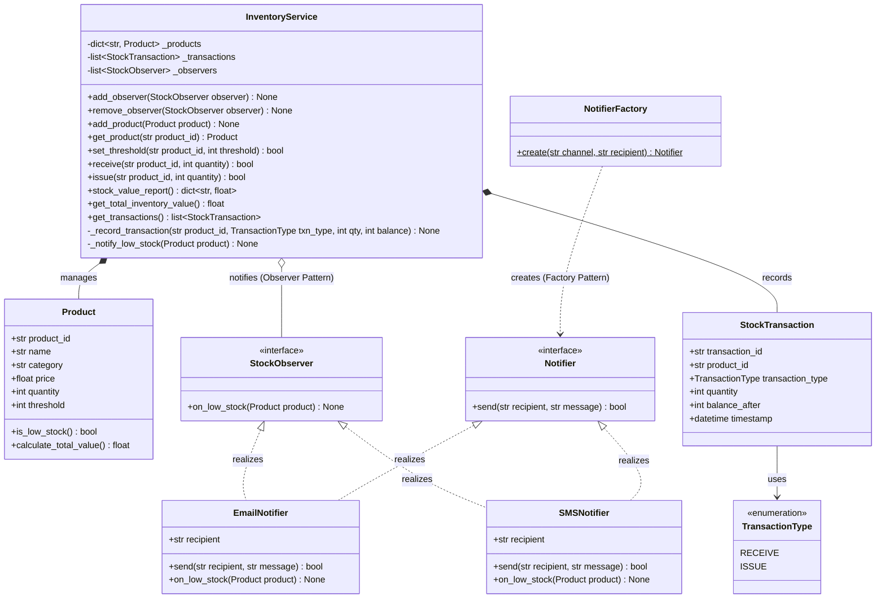

# Class Diagram: Inventory Management System

ไดอะแกรมแสดงโครงสร้างคลาส (Class Diagram) หลังการประยุกต์ใช้หลักการ **SOLID Principles**, **Observer Pattern** และ **Factory Pattern**

```mermaid
classDiagram
    direction TB

    class TransactionType {
        <<enumeration>>
        RECEIVE
        ISSUE
    }

    class Product {
        +str product_id
        +str name
        +str category
        +float price
        +int quantity
        +int threshold
        +is_low_stock() bool
        +calculate_total_value() float
    }

    class StockTransaction {
        +str transaction_id
        +str product_id
        +TransactionType transaction_type
        +int quantity
        +int balance_after
        +datetime timestamp
    }

    class StockObserver {
        <<interface>>
        +on_low_stock(Product product) None
    }

    class Notifier {
        <<interface>>
        +send(str recipient, str message) bool
    }

    class EmailNotifier {
        +str recipient
        +send(str recipient, str message) bool
        +on_low_stock(Product product) None
    }

    class SMSNotifier {
        +str recipient
        +send(str recipient, str message) bool
        +on_low_stock(Product product) None
    }

    class NotifierFactory {
        +create(str channel, str recipient)$ Notifier
    }

    class InventoryService {
        -dict~str, Product~ _products
        -list~StockTransaction~ _transactions
        -list~StockObserver~ _observers
        +add_observer(StockObserver observer) None
        +remove_observer(StockObserver observer) None
        +add_product(Product product) None
        +get_product(str product_id) Product
        +set_threshold(str product_id, int threshold) bool
        +receive(str product_id, int quantity) bool
        +issue(str product_id, int quantity) bool
        +stock_value_report() dict~str, float~
        +get_total_inventory_value() float
        +get_transactions() list~StockTransaction~
        -_record_transaction(str product_id, TransactionType txn_type, int qty, int balance) None
        -_notify_low_stock(Product product) None
    }

    %% Relationships
    InventoryService o-- StockObserver : notifies (Observer Pattern)
    InventoryService *-- Product : manages
    InventoryService *-- StockTransaction : records
    StockTransaction --> TransactionType : uses

    StockObserver <|.. EmailNotifier : realizes
    StockObserver <|.. SMSNotifier : realizes
    Notifier <|.. EmailNotifier : realizes
    Notifier <|.. SMSNotifier : realizes

    NotifierFactory ..> Notifier : creates (Factory Pattern)
```
